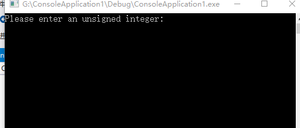
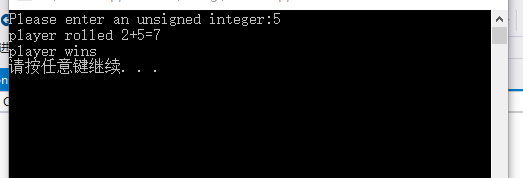
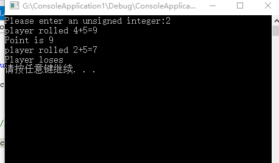

# **骰子小游戏**
*引言*  
---
游戏中通常会用到骰子，小小的骰子作用可大了。比如经典的游戏大富翁，飞行棋等一些经典小游戏中都会使用，因此设计了一个骰子小游戏。  

*游戏界面*
---
1.运行程序进入初始界面，提示输入一个整数  
  
2.输入整数后，计算和数，输出和数  
3.若结果是7或11则输出状态为win  
  
4.若结果是2，3,12则输出状态为lose  
  
5.其它情况，游戏尚无结果，状态为PLAYER，记下点数，为下一轮做准备  
  
*游戏结束*
---
评出游戏结果后按任意键即可退出  

*代码*
---

#include "stdafx.h"

#include <
iostream>

#include<
cstdlib>

#include<
cTime>

using namespace std;

int rollDice() {

	int die1 = 1 + rand() % 6;

	int die2 = 1 + rand() % 6;

	int sum = die1 + die2;

	cout << "player rolled " << die1 << "+" << die2 << "=" << sum << endl;

	return sum;

}

enum GameStatus { WIN, LOSE, PLAYER };

int main() {

	int sum, myPoint;

	GameStatus status;

	unsigned seed;

	cout << "Please enter an unsigned integer:";

	cin>>seed;

	srand(rand());

	srand((unsigned)time(NULL));

	sum = rollDice();  

	switch (sum) {

	case 7:

	case 11:

		status = WIN;

		break;

	case 2:

	case 3:

	case 12:

		status = LOSE;

		break;

	default:

		status = PLAYER;

		myPoint = sum;

		cout << "Point is " << myPoint << endl;

		break;

	}

	while (status == PLAYER) {

		sum = rollDice();

		if (sum == myPoint)

			status = WIN;

		else if (sum == 7)

			status = LOSE;

	}

	if (status == WIN)

		cout << "player wins" << endl;

	else

		cout << "Player loses" << endl;

	system("pause");
	return 0;

}
